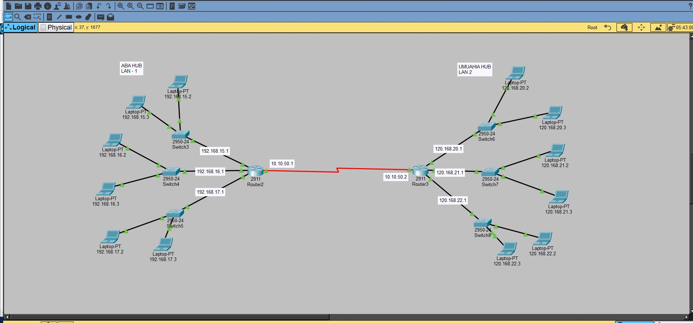

# TASK: Configure Routing Protocol in the Given Network Setup

## Lab Work
**Tool Used:** Cisco Packet Tracer  
- download from:  https://www.netacad.com/resources/lab-downloads?courseLang=en-US
**Configuration Mode:** Graphical User Interface (GUI)

---

## Objective
To configure routing between two interconnected hubs (**ABA HUB** and **UMUAHIA HUB**) using **Static Routing** on Cisco Packet Tracer.
To enable communication between all end devices across both LANs and understand the manual routing process.

---

## Reference Network Topology


**Description:**
- The network consists of two routers connected via a serial link.  
- Each router serves multiple local area networks (LANs) through switches.  
- Devices in one hub (e.g., Aba Hub) must be able to reach devices in the other hub (e.g., Umuahia Hub) via static routes.

---
```

##  Devices and IP Address Summary

|  Device |Port|   IP Address   | Description |
|--------------------------------------------------------------------|
| Router2 | G0/0 | 192.168.15.1 | Switch3 |
| Router2 | G0/1 | 192.168.16.1 | Switch4 |
| Router2 | G1/0 | 192.168.17.1 | Switch5 |
| Router2 | S0/0/0 | 10.10.50.1 | Serial link to Router3 |
| Router3 | S0/0/0 | 10.10.50.2 | Serial link to Router2 |
| Router3 | G0/0 | 120.168.20.1 | Switch6 |
| Router3 | G0/1 | 120.168.21.1 | Switch7 |
| Router3 | G1/0 | 120.168.22.1 | Switch8 |
```
---

## Configuration Procedure (GUI Method)

### Step 1: IP Address Assignment
- Assigned IP addresses to all router interfaces as shown above.
- Configured each end device with the correct IP, subnet mask, and default gateway.

### Step 2: Static Route Configuration
**Router2 (Aba Hub):**
- Destination Network: 120.168.20.0, Subnet Mask: 255.255.255.0, Next Hop: 10.10.50.2
- Destination Network: 120.168.21.0, Subnet Mask: 255.255.255.0, Next Hop: 10.10.50.2
- Destination Network: 120.168.22.0, Subnet Mask: 255.255.255.0, Next Hop: 10.10.50.2

**Router3 (Umuahia Hub):**
- Destination Network: 192.168.15.0, Subnet Mask: 255.255.255.0, Next Hop: 10.10.50.1
- Destination Network: 192.168.16.0, Subnet Mask: 255.255.255.0, Next Hop: 10.10.50.1
- Destination Network: 192.168.17.0, Subnet Mask: 255.255.255.0, Next Hop: 10.10.50.1
